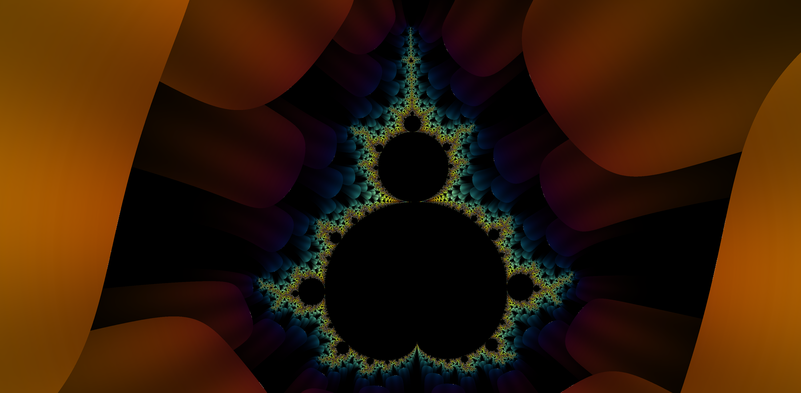
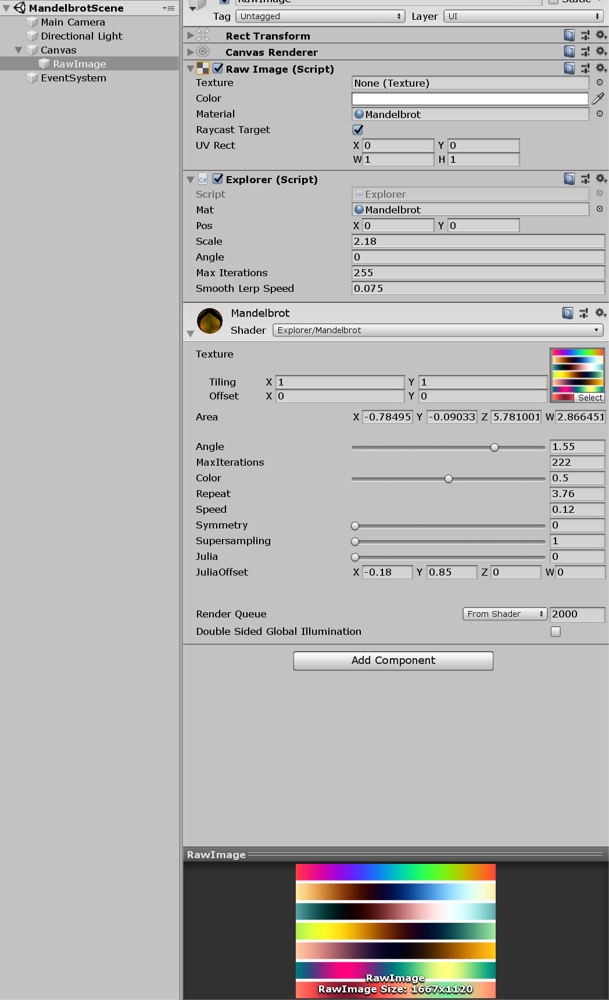

# Mandelbrot Viewer

A viewer for the Mandelbrot Set. This is created with Unity and a shader.

## Controls

Use WASD to move around, Q/E to rotate, and scroll to zoom in/out.

## Parameters

In the scene is a RawImage element, which holds the Explorer script and the Mandelbrot material. The explorer is used to move around in the set, and the material can be used to change parameters for the Mandelbrot set.

 * **MaxIterations**: the number of iterations used to generate the set.
 * **Color**: which y-value in the gradient is used.
 * **Repeat**: multiplies the color so it repeats more often.
 * **Speed**: speed of the color animation.
 * **Symmetry**: enable this to have 8 fold symmetry.
 * **Supersampling**: this is not implemented.
 * **Julia**: set to 0 to display the Mandelbrot set and to 1 for the Julia set.
 * **Julia Offset**: the offset used for `c` in the Julia set.

